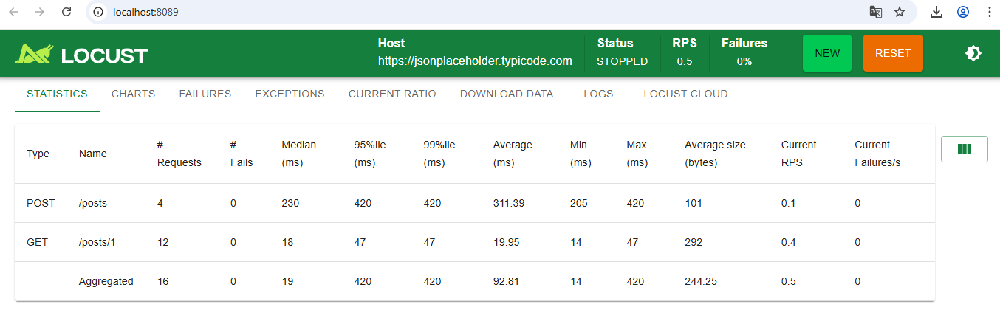

# Projeto de Testes de Carga com Locust - Performance distribuída e escalável para APIs


Este projeto utiliza [Locust](https://locust.io/) para realizar testes de carga em uma API REST pública, simulando múltiplos usuários executando requisições GET e POST.

## 🔧 Tecnologias
- Python 3.x
- Locust

## 📁 Estrutura do projeto

```
load-testing-locust/
├── locustfile.py
├── requirements.txt
├── README.md
├── locust-report.html
├── results/
└── scenarios/
```

## 🚀 Como executar

### Instalar as dependências:
```bash
pip install -r requirements.txt
```

### Rodar o Locust em modo UI (interface web):
```bash
locust -f locustfile.py --host https://jsonplaceholder.typicode.com
```

Acesse `http://localhost:8089`, defina:
- Número de usuários: 50
- Taxa de chegada: 10 usuários/segundo
- Clique em "Start swarming"



### Como rodar um cenário específico:
Basta trocar o `-f` com o nome do arquivo de cenário. Exemplo:
```bash
locust -f scenarios/list_posts.py --host https://jsonplaceholder.typicode.com
```

### Rodar em modo headless com relatório HTML:
```bash
locust -f locustfile.py \
  --host https://jsonplaceholder.typicode.com \
  --headless -u 50 -r 10 -t 30s \
  --html locust-report.html
```

O relatório será salvo como `locust-report.html`.

## ✅ O que está sendo testado
- `GET /posts/1`: Recuperar post
- `POST /posts`: Criar post (fake)

  

### 🧪 Como gerar os CSVs com Locust
Use o parâmetro `--csv` no comando `locust`:

```bash
locust -f locustfile.py \
  --host https://jsonplaceholder.typicode.com \
  --headless -u 50 -r 10 -t 30s \
  --csv results/locust
```

Isso vai gerar:
```bash
results/
├── locust_expections.csv
├── locust_stats.csv
├── locust_failures.csv
└── locust_stats_history.csv
```
---
## 📈 Métricas observáveis
- Requisições por segundo (RPS)
- Tempo médio de resposta
- Percentis P50, P95, P99
- Taxa de erro

> 💡 Esta API é pública e não salva dados de verdade.
---
## ⚖️ Licença
Este projeto está licenciado sob a [CC BY-NC-ND 4.0](https://creativecommons.org/licenses/by-nc-nd/4.0/) - Consulte o arquivo [LICENSE](./LICENSE) para mais detalhes.
